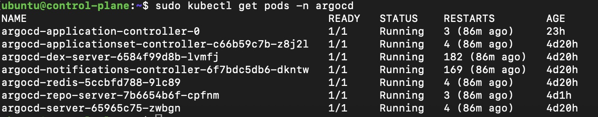

The purpose of this project is to showcase how different technologies can be used together in an DevOps environment. 

Within VPC Infrastructure
`

CI and CD Pipeline


There are three phases in this setup. 
1. Setup the overall architecture in AWS. Including VPC, Subnets, Bastion vm, Jenkins vm, etc. 
2. Use Jenkins pipeline to setup the Kubernetes infrastructure. 
3. Other ad-hoc tasks, such as installing and configuring argoCD, setting up additional git repositories, etc.

### First Phase: Setup the overall architecture in AWS

Within this git repo, cd into "setup-jenkins-in-ec2-aws" directory. Then, cd into "terraform" directory and execute the main.tf file. Edit the other files within the directory as necessary according to your own environment. 

Once the terraform script is ran successfully, cd out of the current directory, and cd into the "ansible" directory. Run all the ansible files within. It does not have to be in any specific order. 
The purpose of these ansible files is mainly to configure the jenkins vm. 

After that is done, login to the jenkins vm, and try to access the jenkins UI. 
Make sure the jenkins service is running by:
```
sudo systemctl status jenkins
```

The jenkins's username is "admin". And its password can generally be found at "/var/lib/jenkins/secrets/initialAdminPassword". 

As in this project, we are using a bastion host in-between, and the jenkins is in a private subnet (To simulate real-life usage, for security and monitoring purposes), we need a way to expose the jenkins's port to our local environment. 

For that we will use SSH ProxyCommand. In your local environment, edit the following file: 
```
vim ~/.ssh/config
```

Fill in content similar to below. (Below is an example from my setup. For yours, you may need to edit accordingly. )
```
Host bastion
    HostName 18.143.246.178
    User ubuntu
    IdentityFile /Users/kaiwork/Desktop/github/resume-project/secrets/resume-project-key-pair.pem

Host jenkins-vm
    HostName 10.0.2.239
    User ubuntu
    IdentityFile /Users/kaiwork/Desktop/github/resume-project/secrets/resume-project-key-pair.pem
    ProxyCommand ssh -W %h:%p bastion

Host kubectlplane-vm
    HostName 10.0.3.69
    User ubuntu
    IdentityFile /Users/kaiwork/Desktop/github/resume-project/secrets/resume-project-key-pair.pem
    ProxyCommand ssh -W %h:%p bastion

Host worker01-vm
    HostName 10.0.4.222
    User ubuntu
    IdentityFile /Users/kaiwork/Desktop/github/resume-project/secrets/resume-project-key-pair.pem
    ProxyCommand ssh -W %h:%p bastion
```

Next, in your local environment, run the following: (Replace 10.0.2.239 to the private ip-address of jenkins vm. The jenkins service should be running at port 8080. Replace 18.143.246.178 to the public ip-address of bastion vm. Make sure you are not using port 8079 in your local environment, else change to another unoccupied port)
```
ssh -i /Users/kaiwork/Desktop/github/resume-project/secrets/resume-project-key-pair.pem -L 8079:10.0.2.239:8080 ubuntu@18.143.246.178
```

Thereafter, if you enter the below address in your local browser, you should be able to visit the jenkins UI.
```
http://localhost:8079/
```

Fill in the correspond credentials and log in. 

Next, install all the recommended plugins. You may install the Blue Ocean related plugins as well, due to better interface and improvement in troubleshooting.

Next create a pipeline. 


Configure the pipeline with the following configuration. The project is parameterized so that we can choose to run specific stage(s) within the pipeline. So that we do not have to run from beginning to end every time. 


Next we will need to setup the credentials as well. 


Thereafter, try to run a build under the newly created pipeline. It should work. 

### Second Phase: Use Jenkins pipeline to setup the Kubernetes infrastructure

Running the Jenkins Pipeline will start the second phase. The Jenkinsfile used by the Jenkins Pipeline will create and configure the control plane and worker node. It will also launch a Kubernetes cluster in it. 

Additionally, a S3 bucket will be created to hold the terraform states. Another S3 bucket will also be created to hold the Ansible's inventory files and its related artifacts. 

After the Jenkins Pipeline is ran finished, you should have a working kubernetes cluster, with a control-plane node and a worker node. 

### Third Phase: Installing and configuring argoCD, setting up additional git repositories, etc.

To test it is indeed a working cluster, we will deploy a simple example application in it. 

There are two stages: Continuous Integration and Continuous Delivery. 

We will commence with Continuous Integration first. 

As it is recommended to create separate git repositories for application source code and application configuration code, I have created two git repositories as listed below. Git clone the below repositories and edit as necessary. 

Below repo will mainly hold application source code.  
```
https://github.com/kaitan8110/resume-project-application-code
```

Below repo will mainly hold the Kubernetes manifest files. 
```
https://github.com/kaitan8110/resume-project-application-configuration-code
```

Additionally, we will use Github Actions to implement the CI pipeline. The workflow file can be found within ".github/workflows" directory in resume-project-application-code repo. 

We will need to setup secrets credentials for github actions as well. 


Example of pipeline ran using github action.


Now, whenever a new commit was push to the resume-project-application-code repo, it will trigger the github actions pipeline to run.

The CI pipeline will basically run on one of github own server. It will do the following:
1. Check out the repository code
2. Set up Docker Buildx 
3. Login to your Docker Hub 
4. Build and push your Docker image to your Docker Hub

Thereafter, there should be a new image (or later version if you have built before) in your image repository in your Docker Hub. 

We will commence with Continuous Delivery next.

For continuous delivery, we will use ArgoCD. (which will be deployed in the control-plane node)

Create a namespace for Argo CD:
```
sudo kubectl create namespace argocd 
```

Install Argo CD using the official manifest:
```
sudo kubectl apply -n argocd -f https://raw.githubusercontent.com/argoproj/argo-cd/stable/manifests/install.yaml
```

Above will create a new namespace, `argocd`, where Argo CD services and application resources will live.

Verify the installation: Check if all the Argo CD pods are running:
```
sudo kubectl get pods -n argocd
```



Next, we will need to access the Argo CD API Server (ArgoCD UI)

We will use the NodePort method to expose the argoCD service port to our local environment. 

Get the argocd-server service, and edit the service to use NodePort. 


Based from the above screenshot, we can know that the argocd-server service is currently expose at TCP 32589 port, using NodePort. 

We can then run the below command in our local terminal to get access to the argocd-server service port. (Using ProxyCommand, as our control-plane node is in private subnet, behind our bastion node, which is in public subnet)(Replace below IP and port accordingly)
```
ssh -i /Users/kaiwork/Desktop/github/resume-project/secrets/resume-project-key-pair.pem -L 8080:10.0.3.69:32589 ubuntu@18.143.246.178 -N
```

Additional Info: 
8080 = Port that you want to map into, in your local env
10.0.3.69 = Control plane Node private ip address 
ubuntu = We are using "ubuntu" as our user, in ubuntu 20.04 OS 
18.143.246.178 = Bastion host/vm public ip address 

Next, enter the below in your local browser. 
```
https://localhost:8080/
```

You should be able to see the argoCD UI. 

Initial Admin Password: Retrieve the initial password for the admin user:
```
kubectl get secret argocd-initial-admin-secret -n argocd -o jsonpath="{.data.password}" | base64 -d; echo
```

Login as the "admin" user with the above retrieved password. 

Next, we will need to create a default project and application in the argocd namespace. Run the below commands in your K8s cluster. 

```
sudo kubectl apply -f - <<EOF
apiVersion: argoproj.io/v1alpha1
kind: AppProject
metadata:
  name: default
  namespace: argocd
spec:
  description: Default project for ArgoCD applications
  destinations:
  - namespace: '*'
    server: '*'
  sourceRepos:
  - '*'
EOF
```

```
sudo kubectl apply -f - <<EOF
apiVersion: argoproj.io/v1alpha1
kind: Application
metadata:
  name: myapp-argo-application
  namespace: argocd
spec:
  project: default

  source:
    repoURL: https://github.com/kaitan8110/resume-project-application-configuration-code.git
    targetRevision: HEAD
    path: dev
  destination: 
    server: https://kubernetes.default.svc
    namespace: myapp

  syncPolicy:
    syncOptions:
    - CreateNamespace=true

    automated:
      selfHeal: true
      prune: true
EOF
```

After a few minutes, you should get the below output if try to get the pods from all namespaces. We can see there are a total of two pods in the "myapp" namespace being deployed. They are our sample-application pods. (Usually our workloads/application pods are not deployed in control-plane node. If you don't want the workload(s) to deploy in control-plane node, you will need to taint the control-plane node accordingly)


Based on the above setup, argoCD will track the changes in the "resume-project-application-configuration-code" repo automatically. Meaning that should there be newly committed code in the repo, it will seek to apply/sync it to the live K8s cluster, so that the state in your configuration repo (which holds the K8s manifests files) is the same as the state in the live K8s cluster.

Now let's try to access our sample application in our local environment. We will use the NodePort method to expose the sample-application service once again. 

(You don't have to edit anything as the below service yaml file is already exposed via NodePort. The below service.yaml file is in the "dev" directory in resume-project-application-configuration-code repo)
```
apiVersion: v1
kind: Service
metadata:
  name: myapp-service
spec:
  selector:
    app: myapp
  type: NodePort
  ports:
  - port: 8080
    protocol: TCP
    targetPort: 8080
```

Run the following command in your local terminal. 
```
ssh -i /Users/kaiwork/Desktop/github/resume-project/secrets/resume-project-key-pair.pem -L 8081:10.0.3.69:30102 ubuntu@18.143.246.178 -N
```

Thereafter, visit the below url in your local env. 
```
http://localhost:8081/
```

You should see the below screenshot. 


This means that our sample-application is correctly running in our K8s cluster, serving requests. 

And that is all!

In this project, we have leveraged a variety of technologies to demonstrate the seamless integration of DevOps tools and practices within a cloud environment. By utilizing AWS for the foundational VPC infrastructure, Jenkins for orchestrating CI/CD pipelines, and Kubernetes for container orchestration, we've built a resilient and scalable environment. Additionally, with the implementation of ArgoCD, we have automated the continuous delivery process, ensuring that our application configurations in the Git repository remain consistent with the live Kubernetes cluster. This project highlights the power of combining infrastructure as code (Terraform and Ansible) with modern CI/CD practices, providing a robust framework for deploying and managing applications efficiently in a production environment.

Thank you for reading. 


<u>Additional Note: </u>
Using cloud resources in AWS cost money. Thus, make sure to destroy all the resources in AWS after finished with the project. You can set "TERRADESTROY" value to "Y", commit to repository, and run the pipeline in Jenkins. It should destroy all the resources in the cloud, used in this project. 


<u>Additional Reference screenshots:</u>

ArgoCD Application main page


ArgoCD Application details page


